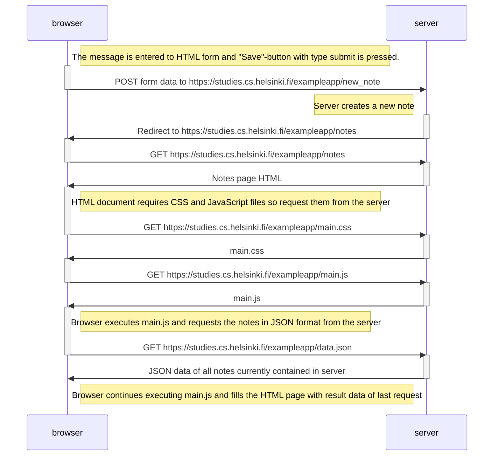
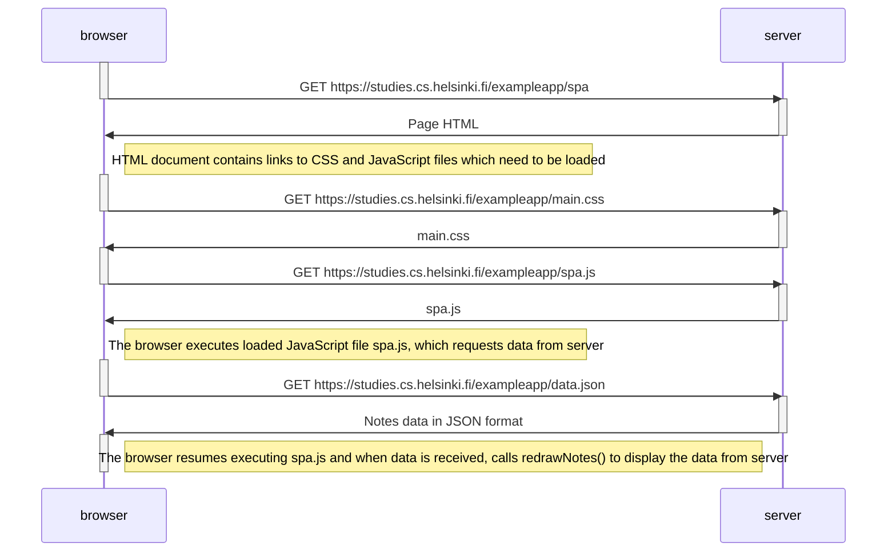

## 0.4

```mermaid
sequenceDiagram
    participant browser
    participant server

    Note right of browser: The message is entered to HTML form and "Save"-button with type submit is pressed.
    activate browser
    browser->>server: POST form data to https://studies.cs.helsinki.fi/exampleapp/new_note
    deactivate browser
    Note left of server: Server creates a new note
    activate server
    server->>browser: Redirect to https://studies.cs.helsinki.fi/exampleapp/notes
    deactivate server
    activate browser
    browser->>server: GET https://studies.cs.helsinki.fi/exampleapp/notes
    deactivate browser
    activate server
    server->>browser: Notes page HTML
    deactivate server
    activate browser
    Note right of browser: HTML document requires CSS and JavaScript files so request them from the server
    browser->>server: GET https://studies.cs.helsinki.fi/exampleapp/main.css
    deactivate browser
    activate server
    server->>browser: main.css
    deactivate server
    activate browser
    browser->>server: GET https://studies.cs.helsinki.fi/exampleapp/main.js
    deactivate browser
    activate server
    server->>browser: main.js
    deactivate server
    activate browser
    Note right of browser: Browser executes main.js and requests the notes in JSON format from the server
    browser->>server: GET https://studies.cs.helsinki.fi/exampleapp/data.json
    deactivate browser
    activate server
    server->>browser: JSON data of all notes currently contained in server
    deactivate server
    activate browser
    Note right of browser: Browser continues executing main.js and fills the HTML page with result data of last request
```

---

## 0.5

```mermaid
sequenceDiagram
participant browser
participant server
    activate browser
    browser->>server: GET https://studies.cs.helsinki.fi/exampleapp/spa
    deactivate browser
    activate server
    server->>browser: Page HTML
    deactivate server
    Note right of browser: HTML document contains links to CSS and JavaScript files which need to be loaded
    activate browser
    browser->>server: GET https://studies.cs.helsinki.fi/exampleapp/main.css
    deactivate browser
    activate server
    server->>browser: main.css
    deactivate server
    activate browser
    browser->>server: GET https://studies.cs.helsinki.fi/exampleapp/spa.js
    deactivate browser
    activate server
    server->>browser: spa.js
    deactivate server
    Note right of browser: The browser executes loaded JavaScript file spa.js, which requests data from server
    activate browser
    browser->>server: GET https://studies.cs.helsinki.fi/exampleapp/data.json
    deactivate browser
    activate server
    server->>browser: Notes data in JSON format
    deactivate server
    activate browser
    Note right of browser: The browser resumes executing spa.js and when data is received, calls redrawNotes() to display the data from server
    deactivate browser
    
```

---

## 0.6